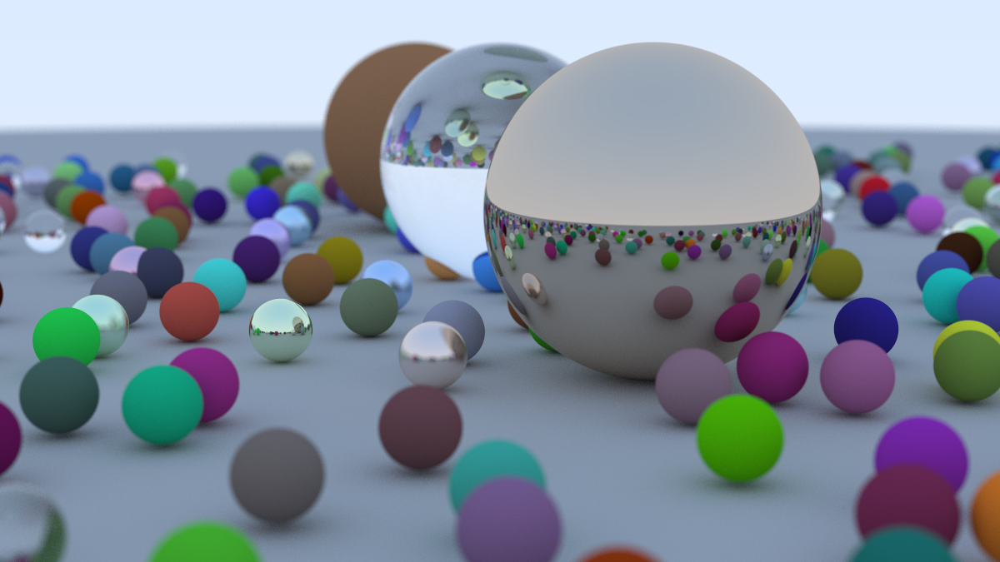

# Ray Tracer

Behold!



This is my implementation of Ray Tracing in One Weekend.

I chose to use Zig for my implementation. This led me to deviate from the book
in a few ways:
- vec3 using a plain struct instead of a backing array.
- No abstract classes for materials/hittables. Instead I use a tagged union strategy.
- Added multithreading on render hot loop. Anecdotal 12-15x speedup.

## Benchmarking

I ran a basic benchmark here for curiosity's sake.

```
Benchmark 1: ./zig-out/bin/ray_tracer 42 13 > /dev/null
  Time (mean ± σ):     64.031 s ±  0.271 s    [User: 817.965 s, System: 1.238 s]
  Range (min … max):   63.761 s … 64.416 s    5 runs
```

Steps to produce:

```bash
zig build -Doptimize=ReleaseFast

hyperfine --warmup 1 --runs 5 './zig-out/bin/ray_tracer 42 13 > /dev/null'
```

Specs:

System:
- Apple M4 Pro (10P + 4E cores)- 24GB Mem
- macOS Sequoia 15.6.1
- Zig 0.16.0

Build:
- ReleaseFast
- 13 threads
- consistent seed = 42

## Comments on Multithreading

I think my multithreading implementation was reasonably simple.
I chose to assign each thread a row instead of a pixel. I also chose
to use an atomic value (effectively very lightweight work queue) for
threads to "pull work." The alternative was partitioning rows ahead of time.
I figured that some rows in the image, like the sky, would be much cheaper to render
than ones with many spheres. The 'work queue' approach means there are no hot threads
and rows get evenly distributed.

## AI Usage

Don't let the CLAUDE.md confuse you. I frequently used Claude
as a tutor when I was confused, however I wrote
the entire ray tracer by hand! I am still unc.
